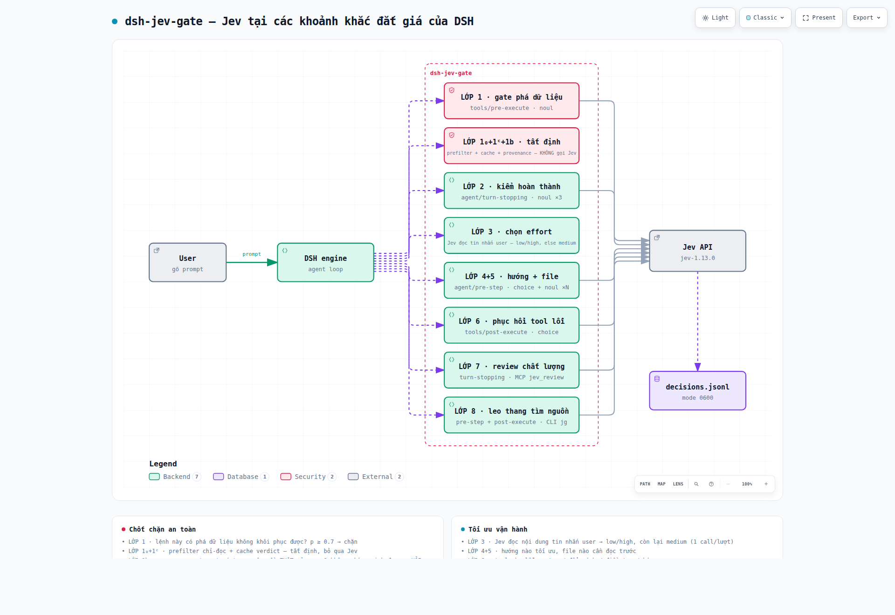

# dsh-jev-gate

**English** · [Tiếng Việt](README.md)



*Interactive diagram (pan/zoom, light/dark theme, search): open
[`assets/architecture.html`](assets/architecture.html) in a browser.*

Put [Jev](https://typesafe.ai/) (TypeSafe System One) into the **moments that
matter** of [DeepSeek Harness](https://github.com/deepseek-ai/dsh), by one rule:

> **The LLM understands and does. Jev only answers a CLOSED question at the
> moment a wrong decision is expensive.**
>
> **If code can derive it, do not call a model.**

Jev does not generate text, plan, or write code. It grades one closed question
and returns a probability. This plugin uses Jev as a **checkpoint**, not a second
brain.

## The layers

Eight moments where Jev is asked, plus deterministic mechanisms that never call
Jev (marked `—` in the Type column): the read-only prefilter (**1₀**) and the
verdict cache (**1ᶜ**). Layer **1b** is deterministic too, but when it cannot
prove authorization it asks the user through a floating card (Type `ask`).
Layer 3 calls Jev in `input` mode and becomes deterministic only with
`effortDecision: 'deterministic'`. Defaults are read straight from `DEFAULTS`
in `lib/index.mjs`.

| Layer | Hook | Question / mechanism | Type | Default |
|---|---|---|---|---|
| **1** · Destructive gate | `tools/pre-execute` | Would this command destroy data irrecoverably? | `noul` | **on** |
| **1₀** · Read-only prefilter | `tools/pre-execute` (before 1) | Prove locally the command cannot write → skip Jev | — | **on** |
| **1ᶜ** · Verdict cache | `tools/pre-execute` (before calling Jev) | Same key `tool+command+cwd` → reuse verdict | — | **on** |
| **1b** · User authorization | `tools/pre-execute` (only when 1 blocks) | Provenance of the target; if unproven → a floating CONSENT card to the user | `ask` | **on** |
| **2** · Completion check | `agent/turn-stopping` | Done yet? Any evidence? Does it need execution? | `noul` ×3 | **on** |
| **3** · Effort routing | `agent/request` | Jev reads the user's message → `low`/`high`, else `medium`; measured signals raise it to a floor | 1/turn | **on** |
| **4+5** · Approach + context choice | `agent/pre-step` (step 1) | Which approach is optimal? Which files to read first? | `choice` + `noul` ×N | **on** |
| **6** · Tool-failure recovery | `tools/post-execute` | Retry, change approach, diagnose, or report? | `choice` | **on** |
| **7** · Quality review | `agent/turn-stopping` | Auto-calls `jev_review` when the turn ends and the diff is large | MCP tool | **on** |
| **8** · Source-search escalation | `agent/pre-step` + `tools/post-execute` | Runs `jg` when the task is "where does X live?" | `jg` CLI | **on** |

The prefilter, the verdict cache, and Layer 1b's provenance decision **never
call Jev** — they are derivable from command syntax / exit code / message
provenance. (Layer **3** calls Jev in `input` mode; set
`effortDecision: deterministic` to make it deterministic too. Layer **1b**,
when provenance cannot be proven, asks the user through a floating card — see
"User authorization" below.)

### Why the "Read-only prefilter" layer exists (1₀)

Layer 1 calls Jev for **every** `bash` command. Measured on the real log
(2026-09-27 → 09-30): 5,600 calls, **80.7%** of them with `p ≤ 0.02` — mostly API
round-trips to hear back something derivable by local syntax analysis. At p50
~289ms and ~718 tokens/call, this is the gate's largest cost.

`lib/readonly.mjs` returns `true` only when it can **prove** the command cannot
write.

**v0.10.0 — added the `for..do..done` loop.** Token-level analysis: a
`for VAR in <literal list>; do <body>; done` loop counts as read-only when the
body — after replacing `$VAR` with a placeholder that is **not a command**
(`__LOOPVAR__`) — is proven read-only. Any doubt (`$()`/backtick/heredoc/write
redirect/`$VAR` in command position/nested for) → `false`.

Measured on the real log (3,369 `allow` commands, snapshot 2026-10-02): prefilter
coverage **13.6%** (459 commands) — before v0.10.0 it was **0.03%** (1 command).
The 455 newly-covered commands all contain the `for` token (no leakage outside
scope).

This is NOT a weakening of protection. Every doubt — heredoc, backtick, write
redirect, `$()` (even inside double quotes), `find -delete`, `sed -i`,
`git reset`, interpreters, unknown commands — falls through to Jev as before.
`tests/offline.mjs` runs **329 destructive commands** and requires **0 to leak**,
plus **384 + 39 fuzz variants**. `tests/attack-corpus.mjs` runs **83 independent
attack commands** (56 dangerous `for` loops + 16 always-deny + 11 disguise
pairs) — requiring **0 leaks**.

**The allowlist is narrower than intuition suggests, and that is a result of
measurement.** The first version, written from reasoning, let **12 forms**
through — found by running real `--help` then trying to write a file in a
sandbox: `trap "rm -f victim" EXIT` (arbitrary command execution),
`hostname NEW` (sets the hostname), `date 010112002026` (sets the clock),
`xxd in out` and `uniq in out` (second argument is a write file), `file -C`,
`less -o`, `history -w`, `rg --pre CMD`, `fd -x CMD`,
`sort --compress-program`, `git --ext-diff`.

Three compensating mechanisms, each for a different class of problem:

| Mechanism | Handles |
|---|---|
| Removed from the allowlist | `trap`, `history`, `hostname`, `xxd`, `uniq`, `split`, `tee` — measured at 0–2 uses per 3,197 commands |
| `POSITIONAL_OUTPUT_COMMANDS` | `uniq in out`, `xxd in out`, `hostname NEW` — must count positional arguments |
| `CONDITIONAL_COMMANDS` per command | `sort -o`, `date -s`, `less -o`, `rg --pre`, `fd -x` — a flag must be tied to a specific command, since `-o` means different things in `grep` and `sort` |

### Why the "Verdict cache" layer exists (1ᶜ)

The gate calls Jev for every `bash` command. Measured on the real log: **~6.2%**
of `allow` commands are **byte-identical strings** (same tool + command + cwd) —
a pure wasted round-trip, since the verdict for a byte-identical command is the
same distribution.

Cache key = `tool + command (verbatim) + cwd + declared workdir`. Only **clear**
verdicts are cached: `allow` (p far from threshold) and `deny`. **`fail_open` is
NEVER cached** — a transient error must not be frozen into a verdict.

**v0.10.1 — do not cache near the threshold.** Jev is **non-deterministic**:
measured on `jev-1.13.0`, `rm -f <file>` yields p straddling the 0.7 threshold
(`0.67, 0.68, 0.69, 0.70`). If a sample `< threshold` (allow) is cached, every
later call serves the old p, **skipping** samples `≥ threshold` that should have
blocked — the cache turns deny into allow. So `gateVerdictCacheMargin` (default
`0.1`) blocks caching when `|p − threshold| ≤ margin`; a verdict far enough from
the threshold cannot flip under drift.

Memory bound `gateVerdictCacheMax` (500) with FIFO eviction + LRU-touch on hit.
Disable with `enableGateVerdictCache: false`.

### Why the "User authorization" layer exists (1b)

The old destructive gate **could not tell session scratch from real data**. Real
log: `rm -rf /tmp/gtest` (a test directory this very session created) was blocked
at p=0.77, while `rm -rf <nonexistent path>` scored only 0.40 — so legitimate
cleanup was blocked and had to be retried (one command was blocked **7 times in a
row**).

The layer runs **only** when layer 1 has already judged the command
destructive, and it answers one question: did the user themselves ask to delete
exactly this? It has three outcomes — **destructive AND user-authorized** →
allow; **destructive AND unprovable** → ask the user; and only when consent is
refused or unavailable does it **deny**:

```
p ≥ 0.7  ──► check provenance: is the target in the user's REAL request?
              ├── yes    ──► ALLOW (allow_authorized)
              └── no / cannot prove
                    └──► ASK THE USER via a floating CONSENT card, then WAIT
                          ├── explicit approval ──► ALLOW (allow_consented)
                          └── refuse / dismiss / timeout / no channel
                                └──► DENY (deny_consent)
```

**v0.13.0 — a CONSENT card for destructive actions the agent proposes on its
own.** The "cannot prove it" branch used to **hard-deny**. But the original
requirement splits in two: the **user's own** request is decisive (user says
delete, it deletes — provenance handles that branch), while when the **agent
proposes** a delete mid-run it must **ask the user and wait for approval**,
never auto-deleting without the user's permission. So the latter branch now
raises a **floating question card** and waits:

- **Approve** = the user selects exactly one label, `"Run it"`, and types **no**
  custom text (the same rule as `dsh-plan-mode`). The command then runs, logged
  as `allow_consented`.
- **Everything else** = DENY, logged as `deny_consent` with error code
  `JEV_CONSENT_DENIED`: choosing `"Do not run it"`, dismissing the card
  (`ASK_CANCELLED`), timing out (`ASK_TIMED_OUT`), or having no user-questions
  channel at all.

**Silence is NOT consent.** Timeout, dismissal, or a missing channel (a
delegated child agent has no human answerer) all **DENY**. No destructive action
runs without explicit approval — this is still a **fail-closed** layer.

**Why `ctx.userQuestions` and not `ctx.approval`.** The `{kind:'ask'}` path of
`tools/pre-execute` goes through `ctx.approval`, but in this deployment
`dsh-purge` has patched `dsh-user-approval` into an **auto-grant**
(`dsh-user-approval/lib/index.js:173-178` returns `"allowed-once"` without asking
anyone). Asking through it is the same as not asking — real consent cannot be
obtained. `dsh-user-questions` is intact and is the real ask-the-user channel
(a floating card the user can click or type into), so Layer 1b uses it. The
precedent is `dsh-plan-mode`'s plan-review card.

Two configs control the consent card: `enableDestructiveConsent` (default
`true`; turning it off restores the old hard-deny for the unproven branch) and
`consentTimeoutMs` (default `120000` — past the deadline the answer is treated
as a refusal). Setting `enableAuthorizationOverride: false` disables the whole
layer and returns to block-everything. Layer 6 also **skips** a command blocked
by the consent card (code `JEV_CONSENT_DENIED`) — a blocked command is not a
"tool failure" to suggest retrying.

**v0.9.0 — dropped the second LLM call.** The old version asked Jev a `choice`
question ("did the user authorize this?") — one more round-trip sitting ON the
critical path of every blocked command. It now derives authorization from
**deterministic provenance**: extract the command's target (path/name from
`rm`/`mv`/`truncate`/…), then substring-match it against the user's **real**
messages. Measured on the real hook (`tests/offline.mjs` section 7b/7c): before =
**2** Jev requests per blocked command (`destructive` + `authorized`), after =
**1** (`destructive`), and when unprovable, **0** extra requests.

The `user_request` evidence is taken **only** from genuine user messages
(`source.kind === 'user'`). `notePrompt` used to join every `role=user` message —
including background job output (`tool-jobs`) and the plugin's own injected hints
— so untrusted content could leak into the "user request" field. Deterministic
provenance uses exactly this source.

This layer is **fail-closed**: if it cannot prove authorization, it asks the
user, and every answer that is not an explicit approval also DENIES. Unlike
layer 1 (fail-open) — a defensive layer must lean toward safety when uncertain.

### Layer 3 — Jev picks effort from the user's message

Default (`input` mode): on every user **turn**, Jev reads the request and decides
that turn's effort level. **Jev may only pick `low` or `high`**; everything else
(Jev error, no task, out-of-set choice) falls back to `medium`. Sticky within a
turn, so it costs **1 Jev call/turn**, not per step.

Two config keys control it:

- `effortJevChoices` (default `['low','high']`) — the levels Jev may pick,
  intersected with the model's `reasoningEfforts`. Fewer than 2 valid → Jev is
  not asked.
- `effortFallback` (default `'medium'`) — applied when Jev cannot decide.

Set `effortDecision: 'deterministic'` to return to the old signal rule (default
`effortDefault`, escalate to `effortEscalateTo` when the previous turn had tool
errors/test failures, **no Jev call**).

**v0.13.0 — measured failure signals are a FLOOR, not the source.** The original
requirement: effort must follow the **user's input**. But ignoring measured
evidence (tool errors / test failures in the previous turn) would be absurd — a
previous step that broke is a strong reason to raise effort. So: the input
content stays the **primary source** (Jev reads and decides), while the measured
signals are sent to Jev under `state.measured_signals` as **secondary evidence**,
and act as a **floor**:

- If Jev picks a level **below** what the signals warrant (`effortEscalateTo` when
  the previous turn had ≥ `effortEscalateToolErrors` tool errors or ≥
  `effortEscalateTestFailures` test failures), the level is **raised to the
  floor**. It is never lowered below the floor.
- If the model does not support the floor level, the floor is skipped and a
  supported level is used instead.
- The `effort_route` log row records `floored_from` + `floor` when the floor
  raised the level, and `signals` for verification.

The three configs `effortEscalateTo` / `effortEscalateToolErrors` /
`effortEscalateTestFailures` now drive the floor in `input` mode too (previously
they were used only in `deterministic` mode). `lib/policy.mjs` exports
`EFFORT_ORDER`, `effortRank`, `effortFloorFromSignals` to compute the floor
deterministically.

**Why Jev only decides the two ends (measured 2026-10-04).** Probing
`effortQuestion` directly, 5 repeats per difficulty, range `low/medium/high/max`:

| Difficulty | 5 runs | Note |
|---|---|---|
| easy (list files) | `low`×5, conf **1.00** | very confident |
| medium (compare 2 libs) | `low`×5, conf 0.29–0.39 | **folds medium into low** |
| hard (trace a leak) | `low`×3, `high`×2 | **drifts** |
| hardest (prove safety) | `max`×5, conf 0.40–0.50 | fairly confident |

`medium` is almost never chosen (1/14 tasks, conf 0.35). Jev is reliable at the
two ends and vague in the middle — so the ends go to Jev, the middle to config.

**v0.13.1 — the effort question must be TURN-LEVEL, not per-step.** The old
phrasing asked *"which reasoning effort is sufficient for the NEXT generation"* —
correct for the old per-step reuse mechanism, but WRONG in practice: Layer 3
fixes the level for the WHOLE turn and keeps it (sticky). Measured on **26
labelled tasks × 5 runs**:

| Phrasing | Correct | easy (16) | hard (10) |
|---|---|---|---|
| old — "NEXT generation" | 21/26 | 16/16 | **5/10** |
| new — "fixed for the WHOLE turn … ENTIRE request" | **26/26** | 16/16 | **10/10** |

All 5 old-phrasing failures share one shape: a request that **names a symptom to
diagnose** ("memory leak", "race condition", "slow query, cause unknown") was
scored `low` because its first step is just reading a file — even though the whole
turn needs `high`. The new phrasing states the level applies to the whole turn and
that "a request whose cause is not yet known is not a routine request"; it does
**not** over-escalate (easy stays 16/16) and is stable across 3 repeats.

**Confidence is NOT used to gate.** Measured on the same labelled set: the
confidence band of WRONG cases (0.52–0.57) sits entirely inside the band of RIGHT
cases (0.00–0.79) — any threshold that cuts the wrong ones also cuts the right
ones. So `confidence` is only written to the `effort_route` log for the operator;
the instructions no longer promise it decides reuse (which was never true in
`input` mode).

At the same time `EFFORT_MEANING` (the criteria Jev reads) was aligned: the old
`low` said *"…including the easy opening step of a hard task"* — a per-step
carve-out that contradicts the turn-level phrasing. Now `low` = *"the whole
request is routine or mechanical"*. Re-measured: still **26/26**.

**History.** This layer was once a per-request classifier calling Jev on EVERY
request (2026-09), then replaced by a deterministic rule (2026-10-01) after
measuring the old mechanism flipping `low↔high` **113/120 times** with 54.5% of
decisions below conf 0.5 and **55%** of Jev tokens. `input` mode differs from the
old version: it calls **once per turn** (not per request), only asks "is this
request hard", and **constrains Jev to the two ends**.

Cache note: on this router, changing effort does **not** invalidate the prompt
cache — measured 96% cache hit after a change.

### Why the "Context choice" layer exists (Layer 5)

This is the clearest cost target. Most input tokens are burned by the model
hunting for relevant files through a chain of tool calls (`glob` → `grep` →
`read` → `read` again), while most of those tokens exist only to answer "which
file is worth reading".

The plugin lists candidates by **file name** (one breadth-first `readdir`, ranked
by tokens matching the task), then asks Jev one `noul` question per **candidate**.
All questions go in **one request**, so 13 batched questions cost 271ms — the
same as a single question. The host compares against `contextFileThreshold`
(0.6), sorts by probability, and cuts to `contextMaxFiles` (3).

Why N `noul` questions instead of one multi-branch `choice`: the file list is
dynamic per repo, whereas `choice.criteria` must be fixed in code — you cannot
build branches for a list unknown ahead of time.

### Why the "Source-search escalation" layer exists (Layer 8)

Layer 5 lists candidates by **file NAME**. Measured on a real session
(`777a1746`): the agent took the file hint **0/4 times** — the hint sat in
context but the agent never opened a file. That session ran **152 raw
`grep`/`find`/`rg` commands** and used the `jevgrep` skill **0 times** despite it
being in the catalog.

Layer 8 fills exactly that gap with the `jg` CLI (the `jevgrep` skill): it asks
Jev "where does this behaviour live" and returns **verbatim source excerpts**.
Two branches:

- **A. `agent/pre-step` (step 1)** — when the user's task reads as "where does X
  live" (`looksLikeSearchTask`).
- **B. `tools/post-execute`** — after `jevGrepSearchTaskThreshold` (3) consecutive
  raw search commands (`isRawSearchCommand`).

The threshold 3 is grounded in measurement: the longest consecutive search run in
the real session — search turns 1/3/4/5/7/8 all **≥3**; short turns 2/9/10 only
**1**.

`jg` runs in the **BACKGROUND** (`jevGrepBackground: true`), with results
injected at the next `pre-step` — the turn never waits. Why: the `jg` cache is
per **query**, not per repo — a NEW query is cold and takes 66s–2m5s, so any
timeout in the await hook is wrong (low never runs, high hangs the turn). Why not
replace Layer 5 entirely: `jg` measured at ~0.9s warm / ~2.6s cold, added to every
turn is wasteful.

### Why the "Tool-failure recovery" layer exists (Layer 6)

A tool error is a cheap and strong signal: it says the previous step was wrong.
Layer 6 asks Jev one `choice` question — retry, change approach, diagnose, or
report — and injects a hint for the next step. The cap `failureMaxPerTurn` (2)
prevents repeated nagging.

This layer **skips** commands blocked by Layer 1 itself: those are not tool
failures but gate blocks, and Layer 1 already has its own message. Detected via
`error.info.code === 'JEV_DESTRUCTIVE'`. It also skips a command blocked by the
Layer 1b consent card (`error.info.code === 'JEV_CONSENT_DENIED'`) — a blocked
command must not be "recovered" as if it were a tool failure.

### Why the "Quality review" layer exists (Layer 7)

When a turn ends and the diff is large enough (`reviewMinChangedLines`, 20
lines), the plugin auto-calls `jev_review` (MCP) and reports scores back to the
agent as a report. The cap `reviewMaxPerTurn` (1) prevents repeated calls.

### Why the `jev-review` skill is no longer needed

The plugin used to ship a `jev-review` skill for the agent to call. The
`jev-review` MCP server already carries its own instructions, so there is a
single source of guidance — the MCP server — plus Layer 7 auto-calling it when a
turn ends.

## Architecture

The plugin is a thin layer between the **DSH engine** and the **Jev API**. It
only registers hooks, asks Jev one closed question, then hands the decision back
to the engine. It does not swap the model, does not generate content, and does
not keep the transcript.

```
dsh-jev-gate
│
├── LAYER 1 · destructive gate        hook: tools/pre-execute
│   ├── LAYER 1₀ · read-only prefilter (local analysis, NO Jev call)
│   │   └── proven read-only ──► allow now (13.6% of real commands)
│   ├── LAYER 1ᶜ · verdict cache (key tool+command+cwd, NO Jev call)
│   │   └── same key + p far from threshold ──► reuse verdict (6.2%)
│   └── the rest ──► ask Jev (noul): "would this command destroy data irrecoverably?"
│       ├── p < 0.7  ──► allow
│       └── p ≥ 0.7  ──► check LAYER 1b
│
├── LAYER 1b · user authorization     hook: tools/pre-execute (only when layer 1 blocks)
│   └── DETERMINISTIC provenance (NO Jev call): is the target in the user's REAL request?
│       ├── yes ──► allow (allow_authorized)
│       └── no / cannot prove ──► floating CONSENT card (ctx.userQuestions), WAIT for the user
│           ├── explicit approval ──► allow (allow_consented)
│           └── refuse/dismiss/timeout/no channel ──► DENY (deny_consent, fail-closed)
│
├── LAYER 2 · completion check        hook: agent/turn-stopping
│   └── ask Jev (noul ×3): "done? evidence? needs execution?"
│       ├── done + has evidence   ──► let the turn end
│       └── not done / no evidence ──► push to keep working
│
├── LAYER 3 · thinking effort         hook: agent/request
│   └── input mode: Jev reads the user message (low/high, else medium); measured
│       failure signals raise it to a floor (effortEscalateTo); sticky within a turn
│       └── writes reasoningEffort  ──► provider and model UNCHANGED
│
├── LAYER 4+5 · approach + file choice hook: agent/pre-step (step 1 only)
│   └── ONE Jev request, two question kinds:
│       ├── choice "which approach is optimal?" (Layer 4)
│       │   ├── one-command-scan   ──► "run a single command, do not split the work"
│       │   ├── scripted-analysis  ──► "write a short script and read the result"
│       │   ├── parallel-workers   ──► "split across subagents in parallel"
│       │   └── guided-interview   ──► "ask the user to clarify first"
│       │       (silent when conf < 0.3; the model decides, the plugin does not act)
│       └── noul ×N "should this file be read?" (Layer 5)
│           ├── the plugin lists candidates by FILE NAME (BFS readdir + ranking)
│           └── injects "read file X" when p ≥ 0.6, at most 3 files
│
├── LAYER 6 · tool-failure recovery   hook: tools/post-execute
│   └── ask Jev (choice): "retry, change approach, diagnose, or report?"
│       └── injects a hint; skips commands blocked by Layer 1 or the Layer 1b consent card
│
├── LAYER 7 · quality review          hook: agent/turn-stopping
│   └── auto-calls the `jev_review` MCP tool when a turn ends + diff ≥ 20 lines
│
└── LAYER 8 · source-search escalation hook: agent/pre-step + tools/post-execute
    └── runs `jg` (jevgrep skill) in the BACKGROUND, injects verbatim excerpts
```

### Life of one turn

```
user sends a message
      │
      ▼
LAYER 4+5 · agent/pre-step (step 1) pick approach + pick files for context
      │                            → inject hints (does not act itself)
      ▼
LAYER 8 · agent/pre-step            task is "where does X live"? → run `jg` in BACKGROUND
      ▼
LAYER 3 · agent/request             once per turn: Jev picks reasoningEffort from the user message (low/high, else medium);
      │                            measured failure signals raise it to a floor (effortEscalateTo)
      │                            → write reasoningEffort, provider and model UNCHANGED
      ▼
LLM responds or calls a tool
      │
      ▼
LAYER 1 · tools/pre-execute         bash/pwsh only: would this command destroy data?
      │                            1₀ read-only prefilter → allow (no Jev call)
      │                            1ᶜ cache same key       → reuse verdict (no Jev call)
      │                            the rest → ask Jev; p ≥ 0.7 goes to LAYER 1b (provenance, else a consent card)
      ▼
LAYER 6 · tools/post-execute        tool just failed: retry / change approach / diagnose / report
      │                            → inject a hint for the next step
      ▼
LAYER 8 · tools/post-execute        after N consecutive grep/find/rg commands with no progress:
      │                            → run `jg` ONCE, inject verbatim excerpts
      ▼
LAYER 2 · agent/turn-stopping       when the model tries to stop: done? evidence?
      │                            → push to keep working if not done / no evidence
      ▼
LAYER 7 · agent/turn-stopping       turn really ended and diff is large enough
      │                            → auto-call jev_review, report scores back as a report
      ▼
turn ends
```

> LAYER 4+5 and LAYER 8 (branch A) run once per turn (step 1). LAYER 3 is hooked on
> **every step**, but asks Jev **once per turn** and reuses the answer (sticky);
> the LLM, LAYER 1, LAYER 1b, LAYER 6 and LAYER 8 (branch B) **repeat** on every
> tool call. The diagram draws one loop for readability.

## Install

Needs DSH `>= 0.1.0-rc.7` and a Jev API key ([typesafe.ai](https://typesafe.ai/)).

```bash
# install
dsh plugin --profile web add git+https://github.com/dungle03/dsh-jev-gate.git

# update to latest
dsh plugin --profile web update dsh-jev-gate
```

Set the key one of two ways:

```bash
# option 1: environment variable
export TYPESAFE_API_KEY="apikey_..."
# option 2: DSH credential store (recommended — independent of your shell)
# add to ~/.dsh/.credentials.yaml under refs:
#   refs:
#     TYPESAFE_API_KEY: "apikey_..."
```

> No key? The plugin **fails open** — every gate stays silent and allows, never
> blocking wrongly. Set the key and restart to enable it.

### Layer 8 also needs the `jg` CLI (optional)

Layer 8 calls the `jg` CLI (the `jevgrep` skill). Without it the layer turns
itself off silently — no error, no blocking. Install `jg` and put it on `PATH`.

## Operating principles

- **Absolute fail-open.** Jev errors, is slow, or returns garbage → the action
  proceeds as if Jev never existed. Jev must not turn its own incident into a
  workflow incident. The only exceptions: the **catastrophic floor** (Layer 1₀)
  and **Layer 1b** — both fail-closed because they are defensive. For Layer 1b
  specifically, when provenance is unproven it **asks the user via a floating
  card and waits**; every answer that is not an explicit approval (including
  timeout / dismissal / no channel) DENIES.
- **Short timeout.** The destructive gate sits on the critical path of every tool
  call: 2s. Slower than that and it fails open.
- **Pin the model.** `jev-1.13.0` rather than `jev-latest`, because an alias
  drifts when a new version ships and answers can change without notice.
- **Thresholds by consequence.** The destructive gate (0.7) differs from the
  completion check (0.5) and the spawn hint (0.6). No single shared number.
- **Bounded state.** Only send: goal/task (max 1,500 chars), the last 6 tool
  results (700 chars each), the final answer (900 chars). Never the whole
  transcript.
- **Never change the model.** The plugin only reads `provider`/`model` and
  optionally writes `reasoningEffort`. Your model is never swapped.
- **Inspectable log.** Every decision is written to
  `~/.local/share/dsh-jev-gate/decisions.jsonl` (mode 0600).

## Configuration

Edit in the profile (`~/.dsh/profiles/web/cordis.patch.yml`) or via the Plugins
page. The list below matches `DEFAULTS` and `Config` in `lib/index.mjs`.

```yaml
- id: jev-gate
  name: dsh-jev-gate
  config:
    destructiveThreshold: 0.7   # p >= this means destructive
    completionThreshold: 0.5    # p < this means not done
    evidenceThreshold: 0.5      # p < this means insufficient evidence
    executionThreshold: 0.5     # p >= this means the goal needs execution
    approachConfidenceThreshold: 0.3
    contextFileThreshold: 0.6   # p >= this means the file should be read
    contextCandidateLimit: 12   # max candidates given to Jev to grade
    contextMaxFiles: 3          # max files named in the hint
    failureMaxPerTurn: 2        # max recovery hints per turn
    completionMaxPerTurn: 2     # max completion checks per turn
    reviewMinChangedLines: 20   # smaller diffs are not reviewed
    reviewMaxPerTurn: 1         # max reviews per turn
    reviewMaxDiffChars: 24000   # max diff chars sent to review
    reviewServerName: jev-review
    reviewReportToAgent: true   # report scores back to the agent via steer
    gateTimeoutMs: 2000
    stopTimeoutMs: 6000
    effortTimeoutMs: 8000
    spawnTimeoutMs: 6000
    contextTimeoutMs: 6000
    failureTimeoutMs: 4000
    effortDecision: input      # 'input' = Jev reads the user message; 'deterministic' = signal rule
    effortJevChoices: [low, high] # levels Jev may pick (input mode)
    effortFallback: medium     # applied when Jev fails/cannot decide (input mode)
    effortDefault: low          # default level in deterministic mode
    effortEscalateTo: high      # escalate level on previous-turn failure (deterministic + the input-mode FLOOR)
    effortEscalateToolErrors: 2   # escalate/floor on ≥2 tool errors in the previous turn (all modes)
    effortEscalateTestFailures: 1 # escalate/floor on ≥1 test failure in the previous turn (all modes)
    jevGrepSearchTaskThreshold: 3  # consecutive grep/find/rg commands to escalate; 0 = disable branch B
    jevGrepMaxPerTurn: 1        # max jevgrep escalations per turn
    jevGrepTimeoutMs: 120000     # budget for one `jg` run (a NEW query is cold, 66s–2m5s); on timeout, fail open
    jevGrepFailureBreaker: 3    # after N consecutive jg failures, disable Layer 8 for the session
    jevGrepBackground: true     # run jg in the BACKGROUND, never blocking the turn
    jevGrepExcerptCap: 4000     # max excerpt characters injected into context
    logDir:                     # log directory; empty = ~/.local/share/dsh-jev-gate (the isolation hook for tests)
    enableDestructiveGate: true
    enableReadOnlyPrefilter: true       # layer 1₀ — proven read-only skips Jev
    enableCatastrophicFloor: true       # deterministic floor — hard deny, never fail-open
    enableGateVerdictCache: true        # layer 1ᶜ — cache verdict by (tool, command, cwd)
    gateVerdictCacheMax: 500            # max cache entries (FIFO + LRU-touch)
    gateVerdictCacheMargin: 0.1         # do not cache when |p - threshold| <= margin (Jev is non-deterministic)
    enableAuthorizationOverride: true   # layer 1b provenance — off restores block-everything behaviour
    enableDestructiveConsent: true      # layer 1b — when provenance is unproven, ask the user via a floating card
    consentTimeoutMs: 120000            # a consent card past its deadline is treated as a refusal (DENY)
    enableCompletionCheck: true
    enableEffortRouting: true
    enableSpawnHint: true
    enableContextTriage: true           # context file-selection layer
    enableFailureRecovery: true         # tool-failure recovery layer
    enableQualityReview: true           # auto-calls jev_review when a turn ends
    enableJevgrepEscalation: true       # source-search escalation via `jg` (needs the jevgrep skill)
```

Retired keys (`effortReuseConfidence`, `effortMaxReuseSteps`,
`authorizationTimeoutMs`) are **warned about loudly** on load, never ignored
silently.

## Verify

```bash
bash verify.sh                    # 8 sections (0–7), needs DSH running + TYPESAFE_API_KEY
node tests/offline.mjs            # 360 checks, no secret needed
node tests/attack-corpus.mjs      # independent attack corpus — requires 0 leaks
node tests/live-check.mjs         # 10 checks, needs TYPESAFE_API_KEY + network
node tests/consent-integration.mjs # 10 checks, needs a local DSH (skipped if absent)
```

- `verify.sh` — 8 sections: location, structure, syntax, dependency resolution,
  profile registration, real boot log, real Jev call with a known answer, and the
  consent card through the real `UserQuestionService`. Exit 1 if any fails.
- `tests/offline.mjs` — 360 checks with no secret: fail-open, model invariance,
  shell-tool-only gating, Layer 4 guard, real-user-message filtering, export
  contract, the `for` loop prefilter, the verdict cache (safety invariants, no
  caching near the threshold), 1b provenance and the consent card end-to-end
  through the real hook (approve → `allow_consented`; refuse / dismiss / timeout
  / no channel → `JEV_CONSENT_DENIED`), the Layer 3 effort floor
  (`measured_signals` sent, raised to the floor, skipped when unsupported,
  `floored_from` + `floor` in the log), the TURN-LEVEL effort question (the
  instructions and criteria are pinned through the real plugin path), and Layer 8
  (parsing `jg` output, detecting search tasks / raw search commands, per-turn
  cap, fail-open). The Layer 8 test uses a **fake** `jg` script on PATH — it
  never calls the real `jg`, so it runs in CI with no network and no `jg`.
- `tests/attack-corpus.mjs` — independent attack corpus (56 dangerous `for` loops
  + 16 always-deny commands + 11 disguise pairs). A mutation test proves the
  corpus has teeth: injecting fake bugs → 12–16/83 leak, the corpus reports a
  GATE HOLE.
- `tests/live-check.mjs` — calls the real Jev API with known-answer cases.
- `tests/consent-integration.mjs` — runs the Layer 1b consent question through
  the **real** `UserQuestionService` (importing `dsh-user-questions` + `cordis`
  from a local DSH): a valid question passes the real validation (no
  `BAD_INTENT`), a wrong `approve` label or a missing `detail` → `BAD_INTENT`,
  approve-with-custom-text → refused, and the real `askTimed` timeout path →
  `{pending:true}` → DENY. Skipped (exit 0) when no DSH is present, so CI stays
  green.
- `tools/repair-session-source.mjs` — repairs old session logs broken by
  versions < 0.3.1 writing `source` as a bare string (see CHANGELOG 0.3.1). Run
  with dsh stopped:

  ```bash
  node tools/repair-session-source.mjs --check   # list files needing repair
  node tools/repair-session-source.mjs           # repair every session in $DSH_HOME
  ```

  Each file keeps its original beside it with a `.bak-sourcekind-<time>` suffix,
  and new bytes pass strict validation before publishing. Files open by another
  process are skipped.

CI (GitHub Actions) runs `offline.mjs` on Node 20 + 22 for every push/PR, and
`live-check.mjs` when the repo has the `TYPESAFE_API_KEY` secret. See
[`.github/workflows/verify.yml`](.github/workflows/verify.yml).

Changelog: [CHANGELOG.md](CHANGELOG.md).

## Measured results

Measurements on the **real API** (`jev-1.13.0`) and the **real decision log**
(`~/.local/share/dsh-jev-gate/decisions.jsonl`). The log is a live file — numbers
drift; each row states its snapshot.

### Current mechanisms (v0.13.x)

| Measurement | Result |
|---|---|
| Offline tests (`tests/offline.mjs`) | **360 checks** PASS, 0 failures |
| Attack corpus (`tests/attack-corpus.mjs`) | **83 commands** — **0 leaks** |
| Safety invariants (offline) | **329 destructive commands** — 0 leak; fuzz 384+39 — 0 leak |
| Prefilter coverage on the real log (3,369 `allow` commands, 2026-10-02) | **13.6%** (459 commands) — before v0.10.0 it was 0.03% |
| Verdict cache savings on the real log | **~6.2%** of gate calls (byte-identical commands) |
| Gate usefulness (`gate_useful_ratio`, 12,166 records) | **0.96%** — 117 denies / 12,166 runs |
| Layer 1b — Jev calls per blocked command | **1** (destructive); before v0.9.0 it was 2 |
| Layer 1b — provenance unproven | **0** extra Jev calls; asks the user via a floating card and waits for explicit approval |
| Layer 3 — Jev calls for effort | **1/turn** (`input` mode); 0 in `deterministic` mode |
| Does the model ever change? | no — invariant across every test |

### History (earlier versions)

| Measurement | Result |
|---|---|
| Destructive gate on 20 real commands | 20/20 correct (recall 100%, precision 100%) |
| Does a deny actually block execution? | yes — a canary survives after a denied `rm -rf` |
| Completion check: evidence vs bare claims | 3/3 branches correct |
| Layer 1 fail-open (missing key / broken store / no llm) | 3/3 pass |
| Approach choice | 9/10 correct (disk scan → 1 command; 5 topics → parallel; vague → ask back) |
| Context choice — threshold boundary | files to read **0.65–0.98**, irrelevant files **0.02–0.18** |
| Tool-failure recovery, 6 runs/case | 4/4 cases stable 6/6 each |
| Layer 5 latency (13 batched questions in 1 request) | median 271ms — same as a single question |
| Layer 6 latency (1 question) | median 267ms |
| **Layer 3 — old mechanism drift (0.7.0)** | flipped `low↔high` **113/120** requests; **54.5%** of decisions had conf < 0.5 |
| **Layer 2 — real failures (0.7.0)** | **48/49** were `This operation was aborted` → dropped `signal` in 0.8.0 |
| **Layer 1b — old mechanism (≤0.8.2, `choice` question)** | pasted content claiming authority: **0/66** returned `authorized`; destructive commands not asked for: **0/48**; legitimate user-requested cleanup: **46/48** — **replaced by deterministic provenance in v0.9.0** |
| **Layer 7 — `jev_review` (0.4.1)** | first real run: `decision:"reviewed"`, 154 lines / 3 files |
| **Layer 8 — real `jg` latency** | **~0.9s warm** (cached), **~2.6s cold**; E2E through the real handler 2.4s |
| **Layer 8 — E2E with real `jg`** | injected the correct verbatim excerpts for 2 files (`handler.js`, `auth.js`) |
| Per-gate latency | median ~250ms (Layer 1b is deterministic, adds no LLM call) |

## What this plugin does NOT do

- **Does not route the model.** It does not change the model, only (optionally)
  the effort.
- **Does not plan or generate content.** Jev only returns a probability for a
  closed question; the LLM is still what understands and does.
- **Does not act on the chosen approach.** Layer 4 only *suggests* an approach;
  DSH's `agent` API does not expose a way to call tools directly, so the model
  decides. It does not guarantee the model complies — and Jev picks the wrong
  approach about 1 in 10 times in measurement.
- **Does not read files for the model.** Layer 5 only *names* files worth
  reading; reading is still done by the model calling a tool. It also reads no
  file content to grade — only file NAMES in the workspace.
- **Layer 8 does read content, but only when triggered.** When the task is "where
  does X live" (or the agent has been hunting with several consecutive `grep`
  commands), Layer 8 runs `jg` to fetch verbatim excerpts. It does **not** edit
  files, does **not** run anything else, and does **not** replace reading the
  real file — the hint always carries "verify against the real file before
  editing". Needs the `jg` CLI; without it the layer turns off silently.
- **Does not self-fix on review scores.** Layer 7 only reports scores back to the
  agent; the agent decides whether to improve further.
- **Does not replace the agent's judgement.** A recommendation is not an
  authorization.

## Uninstall

```bash
dsh plugin --profile web remove dsh-jev-gate
rm -rf ~/.local/share/dsh-jev-gate
```

## License

MIT
