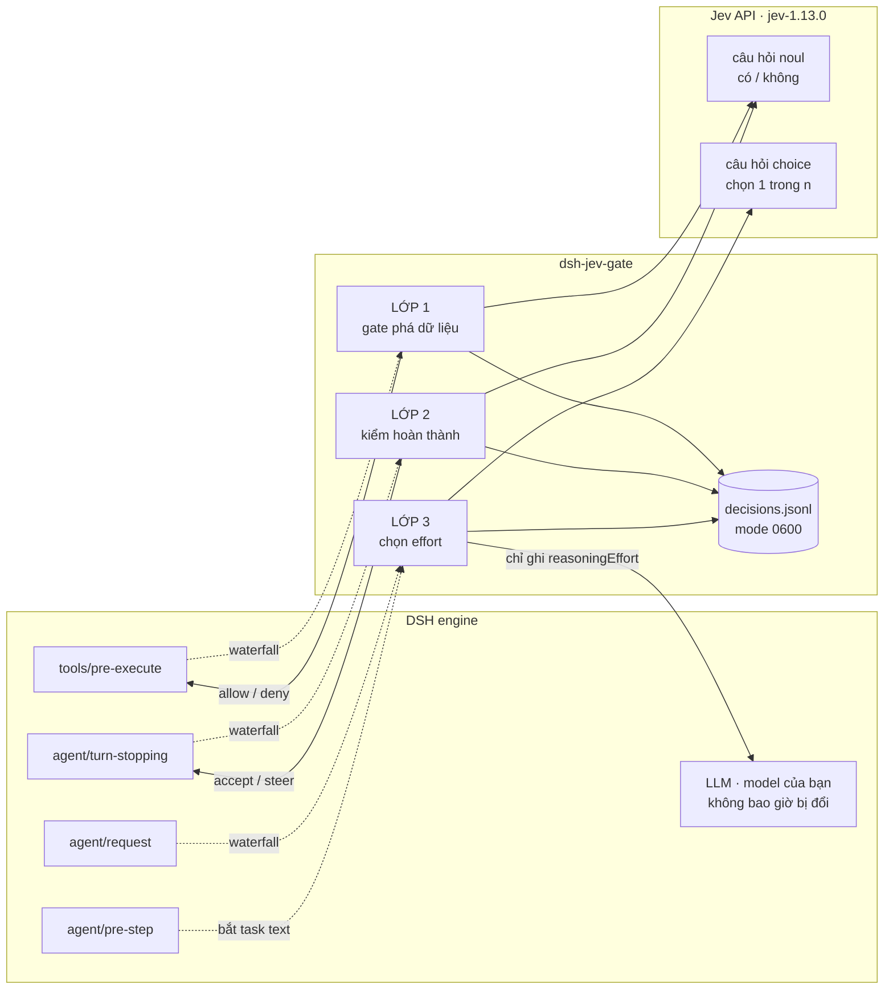
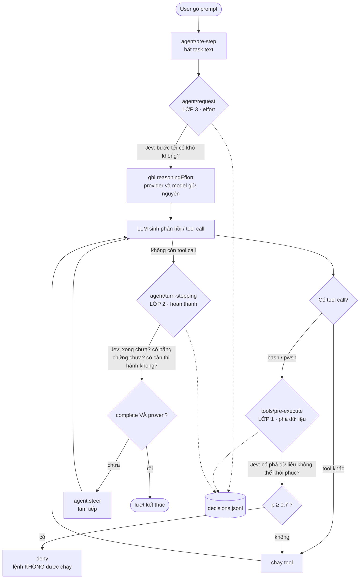

# dsh-jev-gate

[English](README.en.md) · **Tiếng Việt**

Đưa [Jev](https://typesafe.ai/) (TypeSafe System One) vào ba khoảnh khắc đắt giá
của [DeepSeek Harness](https://github.com/deepseek-ai/dsh), theo nguyên tắc:

> **LLM hiểu và làm. Jev chỉ trả lời câu hỏi ĐÓNG ở khoảnh khắc mà một quyết
> định sai gây tốn kém.**

Jev không sinh văn bản, không lập kế hoạch, không chọn tool. Nó chỉ chấm một
câu hỏi đóng và trả về xác suất. Plugin này dùng Jev làm **ba chốt chặn**, không
phải làm bộ não thứ hai.

## Ba lớp

| Lớp | Hook | Câu hỏi | Kiểu | Mặc định |
|---|---|---|---|---|
| Gate phá dữ liệu | `tools/pre-execute` | Lệnh này có phá dữ liệu không thể khôi phục? | `noul` | **bật** |
| Kiểm hoàn thành | `agent/turn-stopping` | Xong chưa? Có bằng chứng chưa? Có cần thực thi không? | `noul` ×3 | **bật** |
| Chọn effort | `agent/request` | Bước tới cần nghĩ nhiều không? Giữ bao lâu? | `choice` ×2 | **bật** |

Lớp 3 bật sau khi đo cache thật: đổi reasoning effort **không** xoá prompt cache
của các effort khác. Cache giữ riêng theo `(prefix, effort)`, nên chi phí duy
nhất là lần đầu chạm một effort mới thì cold — đo được tốn đúng bằng cold của
một prefix mới.

## Kiến trúc

Plugin là một lớp mỏng nằm giữa **DSH engine** và **Jev API**. Nó chỉ đăng ký
hook, hỏi Jev một câu đóng, rồi trả quyết định về cho engine. Nó không thay
model, không sinh nội dung, không giữ transcript.



**Vòng đời một lượt** — ba chốt chặn nằm ở ba thời điểm khác nhau, và mọi lần
gọi Jev đều **fail-open** (Jev lỗi thì đi tiếp như chưa từng có Jev):



## Cài đặt

Cần DSH `>= 0.1.0-rc.7` và một API key Jev ([typesafe.ai](https://typesafe.ai/)).

```bash
# cài
dsh plugin --profile web add git+https://github.com/dungle03/dsh-jev-gate.git

# cập nhật lên bản mới nhất
dsh plugin --profile web add git+https://github.com/dungle03/dsh-jev-gate.git
```

Rồi đặt key Jev (một trong hai cách):

```bash
# cách 1: biến môi trường
export TYPESAFE_API_KEY="apikey_..."

# cách 2: credential store của DSH (khuyên dùng — không phụ thuộc shell)
# thêm vào ~/.dsh/.credentials.yaml mục refs:
#   refs:
#     TYPESAFE_API_KEY: "apikey_..."
```

Khởi động lại DSH. Kiểm chứng:

```bash
bash ~/.dsh/profiles/web/node_modules/dsh-jev-gate/verify.sh
```

> Không có key? Plugin **fail-open** — mọi gate im lặng cho qua, không chặn oan.
> Đặt key rồi khởi động lại để bật.

## Nguyên tắc vận hành

- **Fail-open tuyệt đối.** Jev lỗi, chậm, hay trả rác → hành động đi tiếp như
  chưa từng có Jev. Jev không được biến sự cố của nó thành sự cố của workflow.
- **Timeout ngắn.** Gate chạy trong đường tới hạn của mọi tool call: 2s. Chậm
  hơn thì fail-open.
- **Pin model.** `jev-1.13.0` chứ không `jev-latest`, vì alias dịch chuyển khi
  có bản mới và câu trả lời có thể đổi mà không ai báo.
- **Ngưỡng theo hậu quả.** Gate xoá dữ liệu (0.7) khác ngưỡng kiểm hoàn thành
  (0.5). Không dùng một số chung.
- **Bounded state.** Chỉ gửi: goal, 6 tool result gần nhất (700 ký tự/mục), câu
  trả lời cuối. Không bao giờ gửi cả transcript.
- **Không đổi model.** Plugin chỉ đọc `provider`/`model` và (tuỳ chọn) ghi
  `reasoningEffort`. Model của bạn không bao giờ bị đổi.
- **Có log kiểm được.** Mọi quyết định ghi vào
  `~/.local/share/dsh-jev-gate/decisions.jsonl` (quyền 0600).

## Cấu hình

Sửa trong profile (`~/.dsh/profiles/web/cordis.patch.yml`) hoặc qua trang Plugins:

```yaml
- id: jev-gate
  name: dsh-jev-gate
  config:
    destructiveThreshold: 0.7   # p >= ngưỡng này thì chặn lệnh phá dữ liệu
    completionThreshold: 0.5    # p < ngưỡng này thì coi là chưa xong
    evidenceThreshold: 0.5      # p < ngưỡng này thì coi là thiếu bằng chứng
    executionThreshold: 0.5     # p >= ngưỡng này thì goal cần thi hành
    gateTimeoutMs: 2000
    stopTimeoutMs: 6000
    effortTimeoutMs: 8000
    maxLeaseSteps: 10
    enableDestructiveGate: true
    enableCompletionCheck: true
    enableEffortRouting: true   # mặc định bật
```

## Kiểm chứng

```bash
bash verify.sh              # 6 mục, cần DSH đang chạy + TYPESAFE_API_KEY
node tests/offline.mjs      # không cần secret — fail-open, bất biến model, hợp đồng export
node tests/live-check.mjs   # chỉ cần TYPESAFE_API_KEY + mạng
```

`verify.sh` kiểm: cấu trúc, syntax, resolve dependency, đăng ký profile, log
boot thật, và gọi Jev thật với các case đã biết đáp án. Exit 1 nếu có mục hỏng.

CI (GitHub Actions) chạy `offline.mjs` trên Node 20 + 22 cho mọi push/PR, và
`live-check.mjs` khi repo có secret `TYPESAFE_API_KEY`. Xem
[`.github/workflows/verify.yml`](.github/workflows/verify.yml).

Lịch sử thay đổi: [CHANGELOG.md](CHANGELOG.md).

## Số đo đã kiểm (2026-09-27, `jev-1.13.0`)

| Phép đo | Kết quả |
|---|---|
| 5 test case end-to-end (handler thật + Jev thật) | 9/9 pass, tái lập 3 lần |
| Gate phá dữ liệu trên 20 lệnh thực tế | 20/20 đúng (recall 100%, precision 100%) |
| Deny có thật sự chặn thi hành? | có — canary còn nguyên sau `rm -rf` bị deny |
| Fail-open (mất key / store hỏng / llm vắng) | 3/3 pass |
| Effort sang số theo độ khó | `low→low→high→low→high` qua 5 bước |
| Model có bị đổi không? | không — bất biến qua mọi test |
| Độ trễ mỗi gate | median ~250ms |

## Điều plugin này KHÔNG làm

- Không route model. Không đổi model, chỉ (tuỳ chọn) đổi effort.
- Không phân tích input của user. Việc đó cần LLM, không phải Jev.
- Không chọn tool. `state` mà Jev thấy là catalog tĩnh, mà cái quyết định chọn
  tool là tool result vừa trả về — thứ chỉ có sau khi tool đã chạy.
- Không thay thế phán đoán của agent. Một khuyến nghị không phải uỷ quyền.

## Gỡ

```bash
dsh plugin --profile web remove dsh-jev-gate
rm -rf ~/.local/share/dsh-jev-gate
```

## License

MIT
